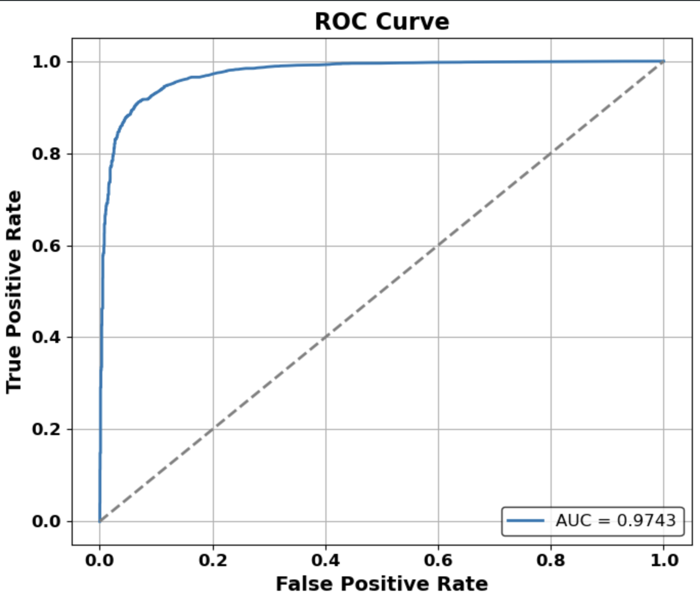
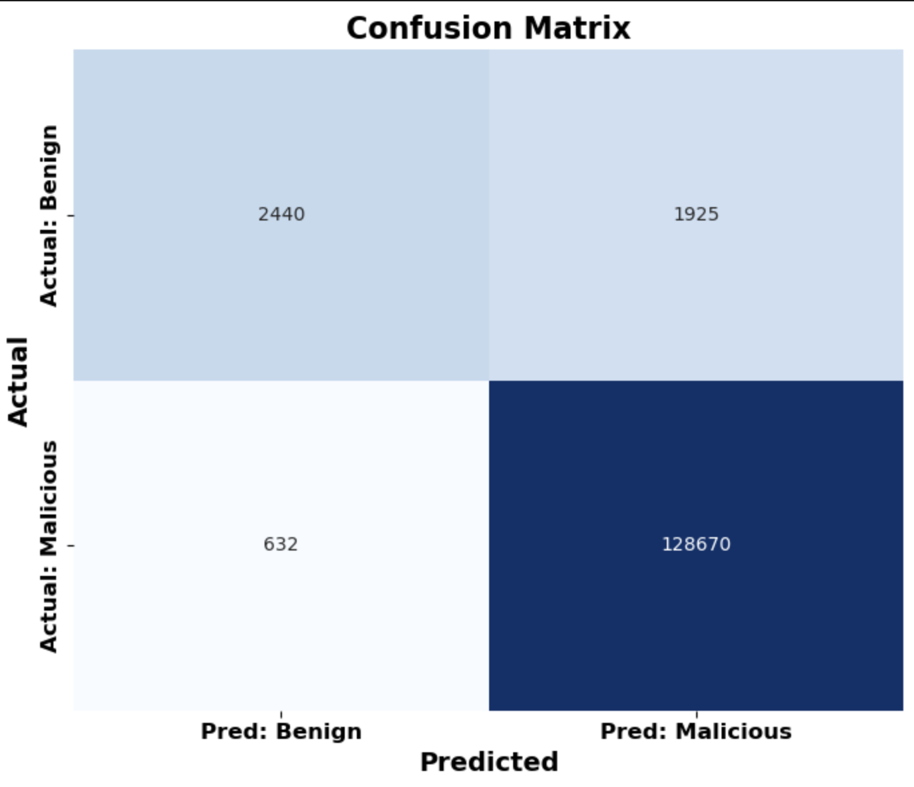

# SD‑CGAN — Sinkhorn‑Enhanced cGAN for DDoS Anomaly Detection (IoT)

A **conditional GAN** trained with **Sinkhorn Divergence** (Optimal Transport) for anomaly detection on **CICDDoS2019**.  
Goal: learn a geometry‑aware representation of **benign** traffic so deviations are flagged as anomalies (e.g., UDP‑Lag / SYN floods).

> Main notebook: [`notebooks/SDCGAN.ipynb`](notebooks/SDCGAN.ipynb)

---

## ✨ Key ideas
- **Conditional GAN (cGAN)** — generator/discriminator conditioned on simple context.
- **Sinkhorn Divergence** — transport‑based objective (`geomloss`) for smooth, stable training.
- **One‑class decision** — train on benign; use discriminator/OT distance as anomaly score.
- **(Optional) CTGAN augmentation** — synthesize minority attack samples for ablations.

---

## 📦 Environment
```bash
python -m venv .venv
source .venv/bin/activate      # Windows: .venv\Scripts\activate
pip install -r requirements.txt
jupyter notebook               # open notebooks/SDCGAN.ipynb
```

`requirements.txt` includes: `torch`, `geomloss`, `ctgan`, `pandas`, `numpy`, `scikit-learn`, `matplotlib`.

---

## 📂 Dataset
- **CICDDoS2019** (Canadian Institute for Cybersecurity). Download CSVs separately.
- Place raw files under `data/` (not committed; ignored by `.gitignore`) and update paths in the notebook.

Recommended splits:
- **Train (benign‑only)** → learn the normal manifold.
- **Validation** → threshold selection / early stopping.
- **Test (benign + attacks)** → report metrics.

---

## 🧠 Method (high‑level)
1. **Preprocessing** — select numeric features; scale; (optional) PCA.
2. **Model** — cGAN (G: latent `z` → benign‑like samples; D: score/energy).
3. **Loss** — **Sinkhorn** between generated and real benign batches via `geomloss.SamplesLoss("sinkhorn", ...)`.
4. **Scoring** — anomaly score from D/OT distance; higher ⇒ more anomalous.

---

## ⚙️ Training knobs to tune
- batch size (128–256), LR (1e‑4..2e‑4, Adam betas 0.5/0.999)
- latent dim (64–128), epochs / early stopping
- Sinkhorn params: `blur`, `scaling`, `p`

---

## 📈 Results (example run)
AUCROC ≈ **0.9743** on held‑out traffic.



**Confusion matrix** at operating threshold (example):  


> Note the heavy class imbalance; report PR‑AUC alongside ROC‑AUC for completeness.

| Metric | Value |
|---|---|
| ROC‑AUC | 0.9743 |
| Recall (malicious) | ~0.995 |
| Precision (malicious) | ~0.985 |
| F1 (malicious) | ~0.990 |

Add more plots (score histograms, PR curve) to `docs/` and link them here.

---

## 🧰 Repo structure
```
sdcgan-anomaly-detection/
├─ notebooks/
│  └─ SDCGAN.ipynb
├─ docs/                # figures: roc_curve.png, confusion_matrix.png
├─ scripts/             # optional helpers
├─ requirements.txt
├─ .gitignore
├─ LICENSE (MIT)
└─ README.md
```

`.gitignore` excludes `data/`, checkpoints, runs, secrets, and PDFs.

---

## 🔁 Reproduce (quick start)
1. Download CICDDoS2019 → move CSVs to `data/`.
2. Open the notebook → set paths → run preprocessing.
3. Train SD‑CGAN → tune Sinkhorn params if needed.
4. Evaluate → export metrics/plots to `docs/`.

---

## 📚 References & Acknowledgements
- Optimal Transport & Sinkhorn — Cuturi; `geomloss`
- CTGAN — Xu et al.
- Dataset — CICDDoS2019 (CIC)

> A related manuscript is **under review** and therefore not included in this repo.

---

## 📄 License
MIT © 2025 Henry Onyeka
